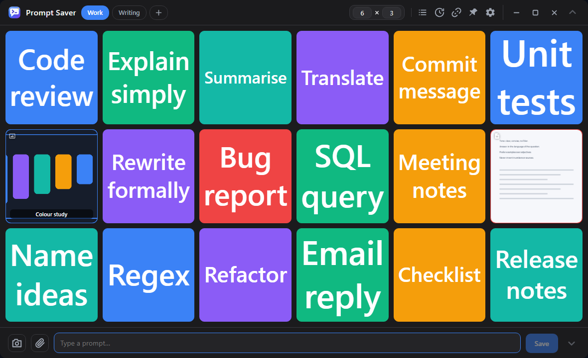

<div align="center">

# Prompt Saver

**Your prompts, one click away — from a grid, from the search, or from a floating button over any app.**

A tiny, fully offline prompt manager for Windows. No account, no cloud, no telemetry.

[](../../releases/latest)
[](../../releases)




</div>

---

## Why

- **Faster than a notes file** — click a tile, the text is in your clipboard.
- **Always within reach** — pin prompts as floating buttons that stay on top of every other window.
- **Yours alone** — everything lives in a local file. The app only goes online if you let it check for updates.

## Features

### 🗂️ Organise

| | |
|---|---|
| **Grid & views** | Free placement on a per-view grid (1×1 up to 20×20), drag tiles anywhere, drop on an occupied cell to swap. Up to 20 named views, each with its own size and layout |
| **Library** | Every saved prompt in one searchable list — copy, edit, drag onto the grid, filter by color or type |
| **Search & sort** | Typo-tolerant search ("promt" still finds "prompt"), sorted by most used or recently used |
| **Favorites** | Star prompts for a live favorites view |
| **Batch editing** | Multi-select in the library to recolor, favorite, move between views, export or delete in one go |
| **Duplicate finder** | Finds near-identical prompts, shows them side by side, keeps the one you pick |

### ⚡ Copy

| | |
|---|---|
| **One click** | Click a tile — the text is copied, a bubble confirms it |
| **Floating buttons** | Pin any prompt as a frameless, always-on-top pill. Drag to move, right-click for size, edit or remove; positions survive restarts |
| **Auto-paste** | A fast second click (or Enter) copies **and** pastes into the app you were just in |
| **Variables** | Write `{#{Name}#}` placeholders and fill them in on copy |
| **Chaining** | Combine several prompts into one clipboard entry |
| **Copy history** | A journal of recent and most-used prompts, with optional timestamps and adjustable retention |
| **Clipboard inbox** | An optional watcher collects text you copy anywhere, so you can turn the good bits into prompts later |

### 🖼️ More than text

| | |
|---|---|
| **Images, GIFs & videos** | Save a picture from the clipboard or a file and paste it anywhere with one click |
| **Video player** | Looping previews on tiles *and* floating buttons, with scrubber, loop and volume — remembered per prompt |
| **PDF & files** | Attach any file by path; a PDF's first page becomes the button's image |
| **Screenshot tool** | Capture a region or a whole window — even protected ones like the Task Manager — and turn it into a copy button |
| **Full-screen viewer** | Click any preview to open it full-screen: scroll to zoom up to 8×, drag to pan |

### 🎨 Make it yours

| | |
|---|---|
| **16 themes** | Light, dark and system (live OS detection), plus Programmer, AI, Cyberpunk, Retro, Gradient and more |
| **Colors & fonts** | Tint tiles and pills from a palette or a color picker; 20 fonts, per prompt if you like |
| **Auto-fit text** | Tile text grows to fill the button, or pick a fixed size |
| **Scaling** | Separate size control for UI, popups, icons and buttons — from 50 % up |
| **Distraction-free** | Hide the top and bottom bars; the grid takes over the freed space |
| **20 languages** | Auto-detected from the system: EN, DE, ES, FR, IT, PT, PL, RU, ZH, JA, NL, TR, KO, HI, ID, VI, CS, UK, SV, RO |

### 🛟 Keep it safe

| | |
|---|---|
| **Backups** | Rotating local snapshots, compressed and encrypted, with diagnostics, a restore list and usage statistics in their own window |
| **Backup password** | Optional — protects new backup files with a key derived from your password |
| **Version history** | Every prompt keeps its earlier versions; preview and restore any of them |
| **Import / export** | One backup file with prompts, views, layouts, colors, styles and language. Plain CSV/TXT export for the texts alone |
| **Careful resets** | "Delete data" and "Reset settings" are separate, both guarded, both with an optional safety backup |

### ⚙️ Under the hood

| | |
|---|---|
| **Expert menu** | Six tabs with an on/off switch for every feature and a parameter for everything adjustable. Settings that are not self-explanatory carry a tooltip |
| **Runs in the background** | Optional minimize-to-tray, autostart at login, global hotkey |
| **Auto updates** | Opt-in check with one-click install, verified against a published checksum |
| **100 % local** | A single local database. No account, no telemetry, no network traffic except the update check |
| **Small** | ~8 MB installer (Rust / Tauri), using the Windows WebView2 runtime |

## Download

From the [latest release](../../releases/latest):

| File | What it is |
|---|---|
| `Prompt.Saver_x64-setup.exe` | **Installer** — all users or current user only, optional desktop / start-menu shortcuts, upgrades keep your data |
| `prompt-saver.exe` | **Portable** — one standalone exe, no installation, keeps its data next to itself |

Both need the Microsoft WebView2 runtime (preinstalled on Windows 11 and current Windows 10; the app offers Microsoft's installer if it is missing).

Full version history: [CHANGELOG.md](CHANGELOG.md)

## Usage

| Action | How |
|---|---|
| Save a prompt | Type it in the input line → **Save** → name + color (Ctrl+Enter works too) |
| Copy a prompt | Click its tile |
| Move a tile | Drag it to any grid cell; drop on an occupied cell to swap |
| Edit / hide / pin / delete | Right-click a tile (or hover **⋮**); deleting asks twice |
| All prompts | List icon in the header: search, edit and place every prompt |
| Screenshot | Camera icon: drag a region or click a window to save it as a copy button |
| Floating button | "Toggle floating button" in the tile menu; right-click the pill for options |
| Views | Tabs next to the title: **+** adds one; right-click a tab to rename, resize, recolor or delete |
| Settings | Gear icon: theme, language, fonts, sizes, autostart, hotkey, import/export, updates, reset |
| Backups | **Backups** in the settings: interval, retention, password, restore list and statistics |

## Building from source

Requirements: [Node.js](https://nodejs.org), [Rust](https://rustup.rs) (MSVC toolchain).

```bat
build.bat
```

or manually:

```sh
npm install
npm run build              # portable exe + NSIS installer
# -> src-tauri/target/release/prompt-saver.exe
# -> src-tauri/target/release/bundle/nsis/Prompt Saver_<version>_x64-setup.exe
```

## Tech stack

[Tauri 2](https://tauri.app) (Rust backend, WebView2 frontend) · vanilla HTML/CSS/JS, no bundler, no framework · SQLite store · `arboard` (clipboard), `rfd` (native dialogs), `pdfium-render` (PDF previews), `xcap` (screen capture), `winreg` (autostart), `sys-locale` (language detection).

Third-party components and their licenses: [THIRD-PARTY-NOTICES.md](THIRD-PARTY-NOTICES.md)
