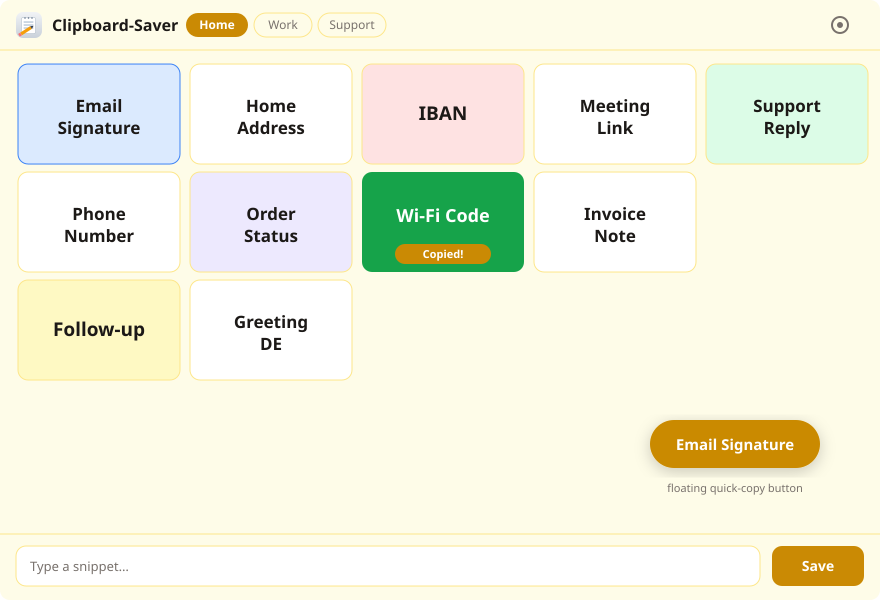

# Clipboard-Saver

A tiny, fully offline Windows tool for storing your frequently used text snippets and copying them to the clipboard with a single click — from a customizable grid or from floating always-on-top buttons that work over any application.



## Features

- **Snippet grid** – free placement on a per-view grid (1×1 up to 20×20, default 5×4), drag tiles anywhere, swap by dropping; layouts are remembered per grid size
- **One-click copy** – click a tile and the snippet text is in your clipboard ("Copied!" bubble confirms)
- **Text library** – header button lists every saved snippet; edit it there, drag it onto the grid or add it with one click
- **Multiple views** – up to 20 named pages, each with its own grid size and layout (quick size control in the header)
- **Floating buttons** – pin any snippet as a frameless, transparent, always-on-top pill; click to copy from anywhere, drag to reposition, right-click for size / edit / remove; positions survive restarts
- **Images** – save a picture from the clipboard or a file and paste it anywhere with one click; or give any text snippet an icon image on its tile
- **Per-snippet colors** – tint tiles and floating pills from a color palette (frames image tiles)
- **Auto-fit text** – tile text grows to fill the button (or pick a fixed size and one of 10 fonts)
- **10 languages** – auto-detected from the system (EN fallback): EN, DE, ES, FR, IT, PT, PL, RU, ZH, JA
- **Import / export** – CSV or TXT including views, layouts, colors and language; re-import restores everything
- **Runs in the background** – optional minimize-to-tray on close, autostart at login (optionally minimized)
- **Auto updates** – daily check for new releases with one-click install (also manually via Settings → Updates)
- **Distraction-free mode** – hide the top and bottom bars with subtle arrows; the grid takes over the freed space
- **Light / dark / system theme** with live OS detection
- **100% local** – data stored as JSON in `%APPDATA%`, no telemetry; the only network access is the (optional) update check
- **Small** – ~7 MB exe (Tauri / Rust), uses the Windows WebView2 runtime

## Download

From the [latest release](../../releases/latest):

| File | What it is |
|---|---|
| `Clipboard-Saver_<version>_x64-setup.exe` | **Installer** – choose all users (admin) or current user only, desktop / start menu shortcuts and "run after install" included (all optional) |
| `clipboard-saver.exe` | **Portable** – single standalone exe, no installation |

Full version history: [CHANGELOG.md](CHANGELOG.md)

Both need the Microsoft WebView2 runtime (preinstalled on Windows 11 and current Windows 10; the app offers the official installer automatically if it is missing).

## Usage

| Action | How |
|---|---|
| Save a snippet | Type it in the input line → **Save** → name + color (Ctrl+Enter works too) |
| Copy a snippet | Click its tile ("Copied!" bubble) |
| Save an image | Image button next to the input: from the clipboard or a file; click the tile to copy it |
| Move a tile | Drag it to any grid cell; drop on an occupied cell to swap |
| Edit / hide / pin / delete | Right-click a tile (or hover **⋮**); deleting asks twice |
| All texts | List icon in the header: view, edit and place every snippet |
| Floating button | "Toggle floating button" in the tile menu; right-click the pill for options |
| Views | Buttons next to the title; manage them in the settings |
| Settings | Gear icon: theme, language, fonts, views & grid sizes, background behaviour, autostart, import/export, reset |

## Building from source

Requirements: [Node.js](https://nodejs.org), [Rust](https://rustup.rs) (MSVC toolchain).

```bat
build.bat
```

or manually:

```sh
npm install
npm run build              # portable exe + NSIS installer
# -> src-tauri/target/release/clipboard-saver.exe
# -> src-tauri/target/release/bundle/nsis/Clipboard-Saver_<version>_x64-setup.exe
```

## Tech stack

- [Tauri 2](https://tauri.app) (Rust backend, WebView2 frontend)
- Vanilla HTML/CSS/JS — no bundler, no framework
- `arboard` (clipboard), `rfd` (native dialogs), `winreg` (autostart), `sys-locale` (language detection)
